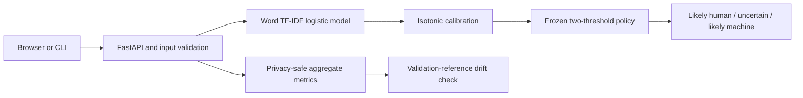

# AuthentiText

AuthentiText is a reproducible research and engineering project for studying
how machine-generated-text detectors behave when domain, generator, editing,
or data distribution changes.

**This system provides a statistical estimate and should not be treated as
proof of authorship.**

The version 1 application returns only:

- likely human-written;
- uncertain; or
- likely machine-generated.

It never attributes text to a named person or generator. The retained model is
a constrained local research baseline, not a production or high-stakes
detector.

## Current status

The repository contains a functioning local text-to-result system backed by
real MAGE experiments, but the complete research roadmap is not finished.

| Area | Verified status |
| --- | --- |
| Data | Pinned MAGE development/OOD and Ghostbuster external acquisition, profiling, preparation, leakage/overlap analysis, and sanitized splits complete |
| Baselines | Majority, length-only, and word TF-IDF logistic models trained and reload-verified |
| Calibration | Isotonic calibration and two-threshold abstention selected from disjoint validation roles |
| Evaluation | Sanitized validation, frozen in-distribution and Ghostbuster external tests, nine domain folds, 27 exact-generator folds, MAGE GPT-4/paraphrase development OOD, and paired prefix truncation complete |
| Local product | Versioned inference, FastAPI, accessible dependency-free interface, aggregate monitoring, and drift checks working |
| Experiment tracking | Ten completed runs and three explicitly unrun candidates in a deterministic hash-linked registry |
| CI | Read-only workflow configured; every command passed in a fresh local clone; no hosted run observed |
| Transformer | Deferred on the audited CPU-only workstation; no transformer was trained or evaluated |
| External evaluation | Pinned Ghostbuster main corpus prepared; overlap-gated frozen evaluation complete on 20,991 records without retuning |
| Docker and deployment | Docker unavailable, no image built, and no deployment target selected |

The living [execution plan](PLANS.md) records every phase, dependency, status,
and important decision without marking deferred work complete.

## System architecture



The same `AuthentiTextPredictor` contract serves CLI, single, batch, and browser
requests. Startup verifies artifact sizes, SHA-256 identities, model types,
calibrator linkage, and threshold ordering. There is no uncalibrated fallback.

## Data and evaluation design

The first cycle uses English data from `yaful/MAGE` pinned at revision
`342663f0a2b775455c023f5d36a1341ff0ec5402`. MAGE raw label 0 is mapped to the
canonical machine-positive target 1. Text is preserved after UTF-8 decoding.

WritingPrompts sources are excluded because they overlap the sealed
Ghostbuster corpus. Normalized-equal records and confirmed sampled high-overlap
relationships are grouped before splitting; conflicting-target components are
dropped. Records are never moved between MAGE's published train, validation,
and test roles.

| Partition | Rows | Human | Machine | Role |
| --- | ---: | ---: | ---: | --- |
| Sanitized train | 287,843 | 86,954 | 200,889 | Fit baseline |
| Sanitized validation | 50,509 | 25,608 | 24,901 | EDA, candidate evaluation, calibration roles, drift reference |
| Sanitized test | 50,567 | 25,634 | 24,933 | One frozen in-distribution evaluation |

The validation partition is hash-assigned to calibration fit, policy selection,
and untouched calibration-audit roles. The published test is scored once after
the artifact, calibrator, thresholds, and response policy are frozen. Its
missed error targets are preserved rather than tuned away.

Ghostbuster was pinned independently, prepared only after the policy was
frozen, and checked against all sanitized MAGE records. The population exact
and normalized checks and bounded 0.8 word-5-gram-Jaccard audit found no
cross-dataset match. Three redundant internal normalized copies were excluded
before the one-time score, leaving 20,991 external records.

The two MAGE OOD files are development stress tests for GPT-4, paraphrasing,
and machine-paraphrased human text. Their repeated human controls are
deduplicated for combined metrics. They are not the sealed external evaluation.

See the [dataset comparison](docs/data/dataset_comparison.md),
[data-lineage record](docs/data/DATA_LINEAGE.md),
[leakage analysis](docs/data/mage_leakage_analysis.md), and
[split policy](docs/data/mage_id_split.md).

## Model and calibration

The selected model is a lowercased word unigram/bigram TF-IDF vectorizer with a
100,000-feature cap and class-balanced logistic regression. It uses no record,
domain, source, or generator metadata as features. A separate isotonic map
calibrates the raw model score.

| Frozen component | Identity |
| --- | --- |
| Base model | 1,578,216 bytes; SHA-256 `474481ed4548f89c3d0308bb8389f114f1e1d55a4436c300e3e9fb08d4eb45dd` |
| Calibrator | 2,080 bytes; SHA-256 `ae50d3947e9a541163346e0fd38ad16cbe7a80a98b9b7ffa0036ce80cfea50d3` |
| Likely-human maximum | `0.231884057971` |
| Likely-machine minimum | `0.717391304348` |

The calibrated value estimates target frequency under the MAGE validation
setup. It is not a universal probability that a human or machine wrote the
input. The middle interval is deliberately uncertain.

The [model-selection record](docs/MODEL_SELECTION.md) explains why the lexical
model remains the local baseline and why unmeasured transformer performance is
not guessed. The [model card](docs/MODEL_CARD.md) contains full configuration,
artifact identity, intended use, subgroup evidence, performance measurements,
and known gaps.

## Measured results

| Evaluation | Rows | ROC AUC | AP | Uncertain | Human → machine | Machine → human |
| --- | ---: | ---: | ---: | ---: | ---: | ---: |
| Frozen sanitized MAGE test | 50,567 | 0.806435 | 0.821832 | 57.0708% | 5.2391% | 5.9880% |
| Deduplicated MAGE development OOD | 3,162 | 0.697370 | 0.867506 | 66.1607% | 12.3360% | 3.7500% |
| Frozen Ghostbuster external | 20,991 | 0.828929 | 0.962187 | 42.9660% | 12.5334% | 1.3001% |

Average precision depends on class prevalence. The OOD combined slice is 75.9%
machine-positive and Ghostbuster is 85.7463% machine-positive, so their higher
AP values do not indicate better generalization. Ghostbuster calibration ECE
is 0.152084, and the human false-machine rate reaches 24.7485% on student
essays. The Ghostbuster external evaluation does not establish production safety.

The frozen MAGE test also supports a prespecified paired prefix-truncation
stress test. Each condition retains only records longer than its budget and
compares the same complete record with its 50-, 100-, or 200-token prefix.

| Prefix budget | Paired rows | Original ROC AUC | Prefix ROC AUC | Original uncertain | Prefix uncertain | Category changed |
| --- | ---: | ---: | ---: | ---: | ---: | ---: |
| 50-token prefix | 36,965 | 0.878027 | 0.671298 | 50.8346% | 69.7849% | 36.0801% |
| 100-token prefix | 25,887 | 0.923264 | 0.805082 | 45.3896% | 62.7187% | 30.0846% |
| 200-token prefix | 14,228 | 0.945366 | 0.886284 | 39.5558% | 52.4670% | 23.1094% |

At 50 tokens, human false-machine rises from 3.3848% to 6.7473% and
machine false-human rises from 4.1176% to 9.5497%. The frozen policy was not
retuned. See the [paired truncation evaluation](docs/evaluation/mage_truncation_robustness.md).

A fixed 21-record qualitative review adds record-level context without source
text in Git. The 9 human false-machine cases span narrative fiction, newswire
reporting, and academic essays; all 6 machine false-human cases use formal or
formulaic prose. Because this is a score-extreme, single-reviewer excerpt
sample, those cue counts are not population rates or causal explanations. See
the [qualitative review](docs/evaluation/ghostbuster_error_review.md).

The nine independently trained and calibrated leave-one-domain-out folds show
additional domain dependence:

| Across nine folds | Minimum | Median | Maximum |
| --- | ---: | ---: | ---: |
| ROC AUC | 0.625869 | 0.702483 | 0.790932 |
| Average precision | 0.650331 | 0.721720 | 0.813803 |
| Brier score | 0.188402 | 0.220005 | 0.254679 |
| Expected calibration error | 0.044945 | 0.096889 | 0.136629 |
| Coverage | 24.1379% | 32.0636% | 42.8159% |
| Uncertain rate | 57.1841% | 67.9364% | 75.8621% |
| Human false-machine rate | 3.5833% | 13.4251% | 23.0015% |
| Machine false-human rate | 0.6552% | 2.0301% | 4.1487% |

All held-domain ROC AUC values fall below the frozen in-distribution aggregate,
and five of nine folds exceed a 10% human false-machine rate. See the
[leave-one-domain-out evaluation](docs/evaluation/mage_domain_holdouts.md).

The 27 independently trained and calibrated leave-one-exact-generator-out
folds show uneven source transfer and severe calibration shift:

| Across 27 folds | Minimum | Median | Maximum |
| --- | ---: | ---: | ---: |
| ROC AUC | 0.636999 | 0.803724 | 0.906497 |
| Average precision | 0.055240 | 0.260767 | 0.576487 |
| Brier score | 0.150343 | 0.154304 | 0.155801 |
| Expected calibration error | 0.275423 | 0.311882 | 0.322583 |
| Coverage | 30.0990% | 34.9902% | 45.5653% |
| Uncertain rate | 54.4347% | 65.0098% | 69.9010% |
| Human false-machine rate | 3.8894% | 5.1611% | 7.3613% |
| Machine false-human rate | 1.3004% | 4.6599% | 18.7726% |

Machine prevalence is only 2.3243% to 7.1165% because every fold retains all
25,634 human test rows. Fourteen folds fall below the frozen in-distribution
ROC AUC, and all five Flan-T5 folds exceed a 10% machine false-human rate. See
the [exact-generator evaluation](docs/evaluation/mage_generator_holdouts.md).

Aggregate results hide severe domain and short-text failures. Text below 50
whitespace tokens receives a low-evidence warning, but the warning does not
change the frozen category. Full Brier/ECE, interval, subgroup, strategy,
generator, length, and OOD results are in the evidence-checked
[model card](docs/MODEL_CARD.md) and
[MAGE OOD evaluation](docs/evaluation/mage_ood.md). The
[Ghostbuster evaluation](docs/evaluation/ghostbuster_external.md) reports its
overlap gate, calibration, domain, generator, prompt-strategy, and interval
evidence.

## Environment and setup

The project supports CPython 3.12 through 3.14 and was resolved on Windows with
CPython 3.14.6. The audited host has 8 logical processors, 15.82 GiB RAM, Intel
HD Graphics 630, and no CUDA, Docker, or Node.js runtime.

Create the locked environment from the repository root:

```powershell
python -m venv .venv
.\.venv\Scripts\python.exe -m pip install --upgrade pip==26.1.2
.\.venv\Scripts\python.exe -m pip install -r requirements\dev.lock
.\.venv\Scripts\python.exe -m pip install --no-deps -e .
```

Then validate it:

```powershell
.\.venv\Scripts\python.exe -m pip check
.\.venv\Scripts\python.exe scripts\build_experiment_registry.py --check
.\.venv\Scripts\python.exe scripts\check_committed_metadata.py
.\.venv\Scripts\python.exe scripts\check_model_card.py
.\.venv\Scripts\python.exe scripts\check_documentation.py
.\.venv\Scripts\ruff.exe check .
.\.venv\Scripts\ruff.exe format --check .
.\.venv\Scripts\python.exe -m unittest discover -s tests -p "test_*.py"
```

See the [environment guide](docs/development/environment.md) for the documented
workspace-specific CPython 3.14 temporary-directory constraint.

## Run locally

Raw datasets, processed text, predictions, and trained artifacts are ignored by
Git. Local inference requires these hash-matching files:

```text
artifacts/baselines/id/word_tfidf_logistic.joblib
artifacts/baselines/id/calibration_policy.joblib
```

With those artifacts present, score UTF-8 text from a file or standard input:

```powershell
.\.venv\Scripts\python.exe scripts\predict_text.py --input path\to\input.txt
Get-Content path\to\input.txt -Raw | .\.venv\Scripts\python.exe scripts\predict_text.py
```

Start the loopback-only API and interface:

```powershell
.\.venv\Scripts\python.exe scripts\run_api.py
```

Open `http://127.0.0.1:8000/` or inspect the API schema at
`http://127.0.0.1:8000/docs`. The service has no authentication or TLS, so a
public bind is unsupported. The [API contract](docs/api/service.md),
[interface guide](docs/frontend/interface.md), and
[local operations runbook](docs/operations/runbook.md) cover request limits,
readiness, privacy-safe smoke checks, monitoring, and failure triage.

## Reproduce data and experiments

The repository does not redistribute raw MAGE text or model artifacts. The
[data-lineage record](docs/data/DATA_LINEAGE.md) provides pinned URLs, hashes,
byte counts, schemas, transformations, and the exact command for each acquired
partition and derived dataset.

Completed model evidence can be verified when its ignored inputs are present:

```powershell
.\.venv\Scripts\python.exe scripts\train_baselines.py --verify-only
.\.venv\Scripts\python.exe scripts\evaluate_baselines.py --verify-only
.\.venv\Scripts\python.exe scripts\calibrate_baseline.py --verify-only
.\.venv\Scripts\python.exe scripts\evaluate_frozen_test.py --verify-only
.\.venv\Scripts\python.exe scripts\evaluate_ood.py --verify-only
.\.venv\Scripts\python.exe scripts\run_domain_holdouts.py --verify-only
.\.venv\Scripts\python.exe scripts\run_generator_holdouts.py --verify-only
.\.venv\Scripts\python.exe scripts\evaluate_ghostbuster.py --verify-only
.\.venv\Scripts\python.exe scripts\evaluate_truncation_robustness.py --verify-only
```

The [experiment log](docs/EXPERIMENT_LOG.md) and generated
[`experiment_registry.json`](data/metadata/experiment_registry.json) bind 10
completed runs to validated source-report hashes and milestone commits. 3
unrun candidates remain explicitly metric-free. A tracking server was not
added because the deterministic local reports already cover the single current
cycle.

## API, monitoring, and drift

The FastAPI service exposes:

- liveness and verified model readiness;
- service, schema, model, artifact, and threshold identity;
- bounded single and batch prediction;
- process-local aggregate request, error, latency, length, score, warning, and
  category distributions; and
- validation-reference drift status.

The monitor stores no submitted text, excerpts, tokens, hashes, request IDs,
per-request records, cookies, browser storage, database rows, or remote
telemetry. A restart clears metrics and drift observations.

Drift uses four aggregate total-variation signals and stays
`insufficient_data` below 760 successful items. Its validation-only audit
flagged 1 of 20 same-distribution windows and all 9 of 9 held-out domain groups.
Those are development backtest observations, not production guarantees. A flag
requests investigation and never retrains or promotes automatically. See the
[monitoring contract](docs/operations/monitoring.md),
[drift contract](docs/operations/drift.md), and
[retraining design](docs/operations/retraining.md).

## Testing and CI

The repository uses standard-library `unittest` plus Ruff. Tests cover data
acquisition and transformations, leakage/splits, analysis, model reports,
calibration, frozen evaluation, inference, API, privacy, interface, monitoring,
drift, OOD evaluation, documentation, and package assets.

The GitHub Actions workflow uses read-only permissions, immutable action commit
pins, locked dependencies, report/registry/document checks, Ruff, the complete
test suite, and a wheel build. It does not download ignored data, train models,
or repeat frozen evaluations. All commands passed in a fresh Windows clone at
commit `d52a3baa43f5a681449f9623fa8782d5d3019a6b`, including 81 tests and the
wheel build. This repository has no configured Git remote and no hosted
workflow run has been observed. See the [CI guide](docs/development/ci.md) and
[clean-room audit](docs/development/clean_room_reproduction.md).

## Responsible use and limitations

Do not use AuthentiText as the sole or primary basis for academic discipline,
employment, fraud or plagiarism findings, moderation sanctions, legal action,
or other consequential decisions. A human reviewer must inspect the full text,
warnings, domain/language fit, and independent evidence, and must preserve an
inconclusive outcome when evidence is insufficient.

Known and unmeasured limitations include:

- English-only, MAGE-specific development;
- lexical sensitivity to topic, source, formatting, and benchmark artifacts;
- severe short-text and domain variation;
- degraded GPT-4/paraphrase OOD calibration and human false-machine behavior;
- material prefix-truncation sensitivity even at 200 tokens;
- no mixed-authorship, multilingual, or production-user validation;
- only one sealed external corpus and no adversarially edited external corpus;
- no transformer comparison; and
- no Docker build, deployment acceptance test, or production rollback test.

The [responsible-AI policy](docs/RESPONSIBLE_AI.md) defines prohibited uses,
required human review, privacy boundaries, misuse and incident response, and
current governance gaps.

## Documentation map

- [Execution plan](PLANS.md)
- [Technical decisions](docs/DECISIONS.md)
- [Dataset comparison](docs/data/dataset_comparison.md)
- [Data lineage](docs/data/DATA_LINEAGE.md)
- [Experiment log](docs/EXPERIMENT_LOG.md)
- [Model selection](docs/MODEL_SELECTION.md)
- [Model card](docs/MODEL_CARD.md)
- [Leave-one-domain-out evaluation](docs/evaluation/mage_domain_holdouts.md)
- [Leave-one-exact-generator-out evaluation](docs/evaluation/mage_generator_holdouts.md)
- [Responsible AI](docs/RESPONSIBLE_AI.md)
- [Inference contract](docs/inference/contract.md)
- [API service](docs/api/service.md)
- [Local interface](docs/frontend/interface.md)
- [Monitoring](docs/operations/monitoring.md)
- [Drift detection](docs/operations/drift.md)
- [Retraining design](docs/operations/retraining.md)
- [Operations runbook](docs/operations/runbook.md)
- [Continuous integration](docs/development/ci.md)

No repository-level software license has been selected. MAGE's release is
tagged Apache-2.0, but upstream source terms still require review before data or
derived-artifact redistribution.
