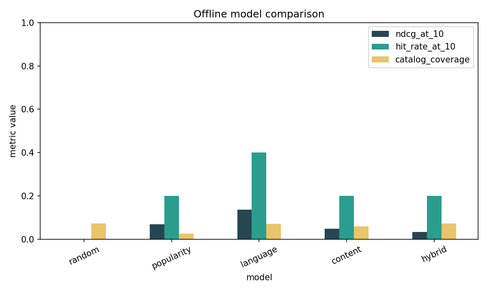

# GitHub Open-Source Repository Recommendation System

[Open the fully executed notebook](github_repository_recommender.ipynb)

I built this project to answer a practical question: can a developer's public GitHub history find relevant open-source repositories that popularity alone would miss? The result is a complete recommendation workflow built from real public data, with chronological evaluation, seen-item filtering, model comparisons, explainable rankings, and reproducible artifacts.

## The result in 30 seconds

The committed no-token run contains **5 public developers, 796 public repositories, and 449 real owned/starred interactions**. Each developer's five most recent stars are held out for testing.

| Model | Precision@5 | Recall@10 | Hit Rate@10 | MAP@10 | NDCG@10 | Coverage | Diversity | Novelty |
|---|---:|---:|---:|---:|---:|---:|---:|---:|
| Random | 0.0000 | 0.0000 | 0.0000 | 0.0000 | 0.0000 | 0.0730 | 0.9864 | 0.6423 |
| Popularity | 0.0400 | 0.0400 | 0.2000 | 0.0400 | 0.0678 | 0.0263 | 0.8946 | 0.1161 |
| **Language only** | **0.0800** | **0.0800** | **0.4000** | **0.0800** | **0.1357** | **0.0701** | 0.9300 | 0.4181 |
| Content based | 0.0400 | 0.0800 | 0.2000 | 0.0180 | 0.0476 | 0.0599 | 0.4081 | 0.6959 |
| Hybrid | 0.0400 | 0.0400 | 0.2000 | 0.0133 | 0.0339 | 0.0730 | 0.7506 | 0.5238 |

The honest result is that the **language-only baseline won**, with NDCG@10 of `0.1357` and Hit Rate@10 of `0.40`. Content beat random, but not popularity or language-only. The tuned hybrid also did not win. That is not a failure to hide—it is evidence that primary language is the most dependable signal in this small sample and that richer ranking needs more users and more complete metadata.

These numbers describe five selected users; they are not population-level performance claims.

## Why this matters

GitHub discovery is naturally popularity-led. That is useful for finding famous projects, but it can bury smaller repositories that fit a developer's actual languages or interests. A better ranking can support project exploration, contribution discovery, and long-tail exposure without pretending to know a person's private intent.

The system supports one decision: **which unseen repositories should appear first for this developer?** It does not rank all of GitHub, infer sensitive traits, or make automated decisions about contributors.

## How I built it

1. Load real public developer, repository, language, and interaction records.
2. Validate schemas, types, duplicates, timestamps, missing metadata, and collection failures.
3. Split each timestamped star history into training, validation, and the five most recent test items.
4. Build developer profiles from training-only owned/starred repositories using interaction weights.
5. Clean descriptions, bounded README text, topics, and language tokens without aggressive stemming.
6. Build separate content, language, topic, activity, quality, and popularity scores.
7. Exclude every seen, archived, disabled, forked, empty, or extremely inactive repository.
8. Tune TF–IDF settings and hybrid weights on validation data only.
9. Compare random, popularity, language-only, content, and hybrid rankings on the untouched test split.
10. Save recommendations, explanations, figures, metrics, processed tables, and model artifacts.

Collaborative filtering is intentionally not used. The sample has only five developers and almost no cross-user item support, so an item-item or factorization model would look sophisticated without being reliable.

## Data and features

The primary source is the official [GitHub REST API](https://docs.github.com/en/rest), using repository search, public user profiles, and timestamped public starred repositories. GitHub's public raw-content host supplies bounded README and contribution-file checks. The first unauthenticated pass reached the hourly core limit; collection resumed from cache after reset and completed all five histories through the API.

The repository ranker uses:

- TF–IDF similarity from descriptions, README text, topics, and language tokens
- weighted primary-language and topic affinity
- recent push activity and repository maturity
- README, license, contribution guide, code of conduct, and issue-label indicators when known
- log-scaled stars and forks with a deliberately small popularity weight

The selected TF–IDF configuration used README-enhanced unigram text and produced a `796 × 4,572` sparse matrix. On validation data, the best README-enhanced content configuration reached NDCG@10 `0.1214`, compared with `0.0632` for description-only text. README content helped the content model in this sample, even though language-only still won the final comparison.

Initial interaction weights are modelling assumptions: contributed `5`, owned `4`, forked `3`, and starred `2`. Equal weights are included in the robustness checks.

## Recommendation examples

The saved examples use the tuned hybrid to demonstrate the full multi-signal ranking and explanation path. I do not label that hybrid as the best offline model; the table above remains the model-selection evidence.

| Developer | Example repository | Why it appeared |
|---|---|---|
| `karpathy` | [`scikit-learn/scikit-learn`](https://github.com/scikit-learn/scikit-learn) | Python is strong in the public profile, machine-learning topics overlap, and the project is active. |
| `gaearon` | [`bcherny/json-schema-to-typescript`](https://github.com/bcherny/json-schema-to-typescript) | TypeScript matches the profile, related topics overlap, and the project is active. |
| `hadley` | [`REditorSupport/languageserver`](https://github.com/REditorSupport/languageserver) | R matches the profile, R-related topics overlap, and the project is active. |

All 50 examples include rank, URL, overall score, every component score, and a feature-grounded explanation in [`outputs/recommendations.csv`](outputs/recommendations.csv).

## Visual checks




The notebook also saves separate figures for developer activity, followers, repository stars, forks, issues, languages, metadata coverage, interaction types, and the long tail. Each figure has a technical reading and a product interpretation in the notebook.

## Run the project

Python 3.11 is recommended.

```bash
python -m venv .venv
# Windows: .venv\Scripts\activate
# macOS/Linux: source .venv/bin/activate
python -m pip install -r requirements.txt
jupyter notebook github_repository_recommender.ipynb
```

For a clean command-line execution:

```bash
jupyter nbconvert --to notebook --execute --inplace --ExecutePreprocessor.timeout=600 github_repository_recommender.ipynb
```

The notebook defaults to the committed sample and needs no token. To collect a larger sample, copy `.env.example` to `.env`, add a GitHub token locally, and use the reusable client in notebook sections 8–9:

```text
GITHUB_TOKEN=your_token_here
```

Never commit `.env`; the project-level `.gitignore` excludes it, raw API caches, notebook checkpoints, virtual environments, logs, and local Matplotlib cache files.

## What is in the repository

```text
GitHub Open-Source Repository Recommendation System/
├── github_repository_recommender.ipynb  # complete executed workflow
├── README.md
├── requirements.txt
├── .env.example
├── .gitignore
├── LICENSE
├── data/
│   ├── raw/                              # ignored API cache
│   ├── sample/                           # fixed real-data input for no-token runs
│   └── processed/                        # cleaned tables produced by the notebook
├── outputs/
│   ├── figures/
│   ├── recommendations.csv
│   ├── model_comparison.csv
│   ├── evaluation_metrics.csv
│   └── data_quality_summary.csv
└── models/
    ├── tfidf_vectorizer.joblib
    └── repository_feature_matrix.joblib
```

The similar-looking `data/sample/` and `data/processed/` folders are deliberate. `sample/` is the fixed public API snapshot that lets a reviewer run the project without network calls; `processed/` is the normalized output proving what the executed notebook produced. Raw responses are larger and are therefore cached locally but not committed.

## Limitations and responsible use

- Five selected developers are too few for stable generalization or subgroup claims.
- Public stars are noisy interest labels and do not prove contribution intent.
- The catalog comes from selected searches and histories, not every GitHub repository.
- README checks cover a subset; byte-level language and issue-label data are missing in reduced mode.
- The popularity baseline has very low novelty (`0.1161`), confirming popularity bias in this sample.
- Limited-history thresholds are reported as robustness diagnostics, but there are too few users for a reliable cold-start performance claim.
- Public availability does not justify sensitive-trait inference. A real product should let users inspect, correct, and delete their feedback profile.

## What I would improve next

The next improvement should be better evidence, not a more complicated model: collect 50–150 consent-aware public developers and 1,000–5,000 repositories with an authenticated token, fetch complete language and issue-label signals, repeat temporal evaluation across more windows, and add bootstrap confidence intervals. Only after user/item overlap improves would I reconsider collaborative filtering. Explicit user feedback could then replace hand-tuned ranking weights.

## License

Released under the [MIT License](LICENSE).
