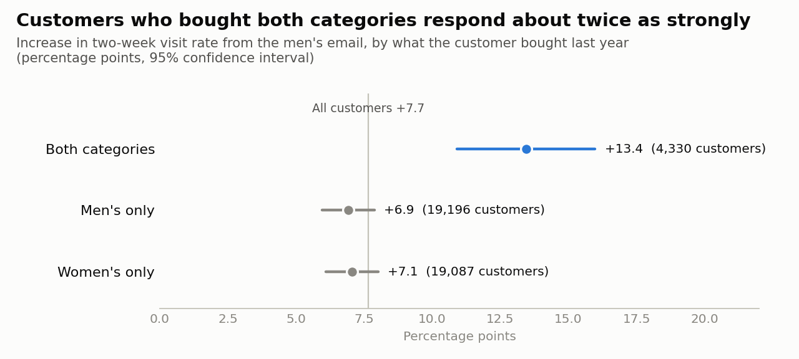
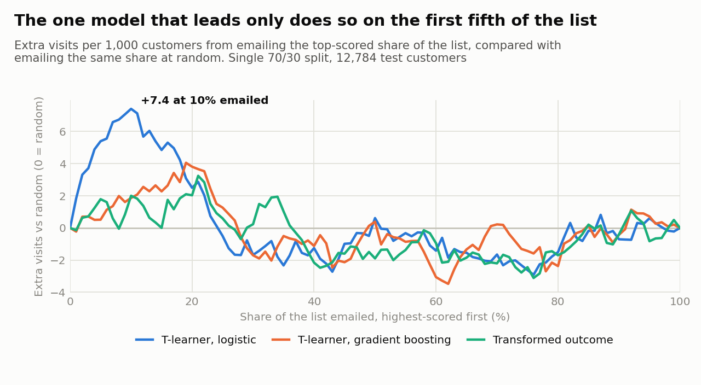
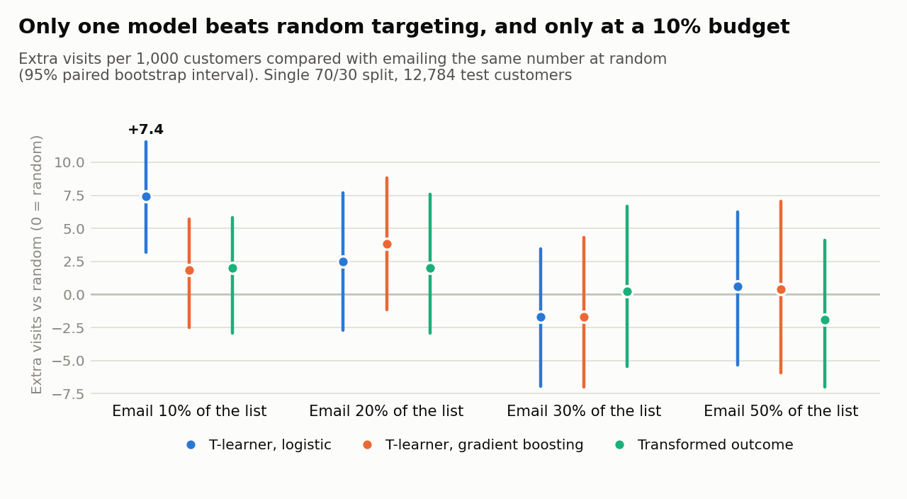
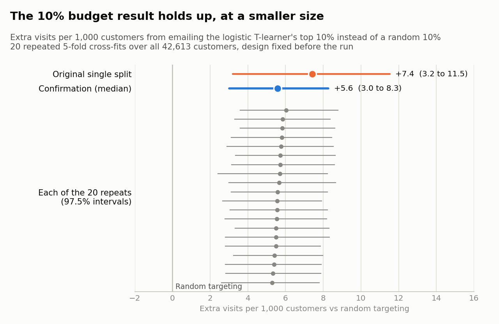

# OfferLift: Who Should Get the Email?

A retailer emailed a random two-thirds of its customers and tracked what they did over the
next two weeks. I wanted to answer two questions with that data. Did the email actually
change behavior? And if next time the budget only covers part of the list, can we pick the
people worth emailing better than picking at random?

Short answer: the email works, and there is one group worth emailing first. Customers who
bought **both men's and women's** products last year respond about twice as strongly as
everyone else. Past that group, none of the models I tried did better than random.

[Try the budget planner](https://offerlift.onrender.com) (it's on a free host, so give it up
to a minute to wake up) · [One-page summary for non-technical readers](docs/BUSINESS_SUMMARY.md)

<picture>
  <source media="(prefers-color-scheme: dark)" srcset="reports/figures/segment_lift_dark.png">
  
</picture>

## The data

The [Hillstrom MineThatData email test](data/README.md) from 2008: 64,000 customers split at
random into three groups of about 21,000. One got an email featuring men's products, one
got a women's email, and one got nothing. For each customer we know what they bought in the
past year and whether they visited, bought or spent in the two weeks after.

## First, can the experiment be trusted?

Before looking at any effects I checked the split itself. The three groups are the sizes
they were meant to be (sample ratio mismatch test, p = 0.92), and they look alike on
everything measured before the email (largest standardized difference 0.014, where 0.1
would be a warning). With about 21,000 people per group, the test could pick up a change in
visit rate as small as 0.8 points.

## Did the email work?

Yes, and the men's email worked better.

| Compared with no email | Visit rate | Purchase rate | Spend per customer |
| --- | --- | --- | --- |
| No email (baseline) | 10.6% | 0.57% | $0.65 |
| Men's email | **+7.7 pts** (95% CI 7.0 to 8.3) | +0.68 pts (0.50 to 0.86) | +$0.77 (0.49 to 1.05) |
| Women's email | **+4.5 pts** (3.9 to 5.2) | +0.31 pts (0.15 to 0.47) | +$0.42 (0.17 to 0.68) |

Both visit effects hold up after correcting for testing two emails (Holm).

I also tried CUPED, a common trick for shrinking confidence intervals by adjusting for
behavior before the test. It did almost nothing here: past-year spend explained 0.04% of the
noise in two-week spend. That's useful to know, because it means CUPED would need a
better pre-test measure to help with tests like this one.

## Can a model pick better customers than chance?

Mostly, no. I trained three uplift models (T-learner with logistic regression, T-learner
with gradient boosting, and a transformed-outcome model) on 70% of the men's email and
no-email customers and scored the other 30%. Across the whole list, none of them ranked
customers better than random order. Every Qini coefficient was indistinguishable from zero.

<picture>
  <source media="(prefers-color-scheme: dark)" srcset="reports/figures/gain_curves_dark.png">
  
</picture>

There was one exception. When only 10% of the list gets emailed, the logistic model's picks
produced 7.4 more visits per 1,000 customers than a random 10% (95% CI 3.2 to 11.5). It was
the only one of twelve model and budget combinations that beat random.

<picture>
  <source media="(prefers-color-scheme: dark)" srcset="reports/figures/budget_gain_dark.png">
  
</picture>

## Was that 10% result luck?

The best of twelve tries on one data split is exactly the kind of result that tends to
disappear. So before checking it I wrote down a stricter test and what would count as a
pass (in [`docs/ANALYSIS_PLAN.md`](docs/ANALYSIS_PLAN.md) and `configs/config.yaml`): use all
42,613 customers, score each one with a model that never saw them, repeat with 20 different
splits, and only call it real if the combined 95% interval stays above zero.

It passed. The gain came out at **+5.6 visits per 1,000 customers** (95% CI 3.0 to 8.3), and
all 20 repeats landed between +5.3 and +6.0. So the effect is real but smaller than the
first split suggested. At a 10% budget that's about 13.3 extra visits per 1,000 customers
instead of 7.7, or roughly 1.7 times as many from the same number of emails.

<picture>
  <source media="(prefers-color-scheme: dark)" srcset="reports/figures/confirmation_dark.png">
  
</picture>

## Who is the model actually picking?

When I looked at the customers the model put in its top 10%, the answer was simple: every
one of them had bought from both the men's and women's ranges last year, and it picked 99%
of the 4,330 customers who had. The model had learned a one-line rule.

The experiment confirms that group is different without using the model at all. The men's
email raised their visit rate by **13.4 points** (10.9 to 16.0), against 6.9 for men's-only
buyers and 7.1 for women's-only buyers. Their purchase rate rose more too. Their extra spend
was higher but not by a clear margin. The women's email shows the same pattern.

Nothing else mattered once that was accounted for. Past-year spend and shopping channel
looked like signals at first, but only because every both-category buyer spent over $200.
Among single-category buyers they made no difference. I ran this part after the
confirmation test, so it explains that result rather than testing something new. All the
segment numbers are in `reports/metrics/targeting_profile.json`.

## What I'd recommend

- **If you can email about 10% of the list or less,** send it to customers who bought both
  men's and women's products last year. It's a filter any CRM can run, with no model to
  maintain.
- **If you can email more,** fill the rest at random. Nothing beat random past that point.
- **Before relying on it,** run one small check at the next campaign: email both-category
  buyers and a random group of the same size, with a few held back from each, and see if
  the gap shows up again. Everything above comes from a single 2008 test.

## How it's built

| What | Where |
| --- | --- |
| Download with a checksum check, then validate the data | `scripts/download_data.py`, `src/offerlift/data.py` |
| Experiment checks, effects, CUPED, multiple-testing correction | `src/offerlift/experiment.py` |
| Uplift models and how they're scored | `src/offerlift/uplift.py`, `src/offerlift/evaluation.py` |
| Budget table and the 20-split confirmation | `src/offerlift/policy.py`, `src/offerlift/confirmation.py` |
| Who gets targeted, and effects by customer group | `src/offerlift/segments.py` |
| Charts and the budget planner app | `scripts/build_figures.py`, `app/app.py`, `src/offerlift/planner.py` |
| Choices fixed before running, and what changed after | `configs/config.yaml`, `docs/ANALYSIS_PLAN.md` |

The tests use made-up data where I know the true effect, so they check that each method
finds it, that a lopsided split gets flagged, and that no outcome data leaks into the
model's inputs. CI reruns the tests and the full analysis on every change.

I built this with an AI coding assistant (Claude Code). I directed the work and made the
calls on what to test, what to trust and what to report. The assistant wrote much of the
code and first drafts of the docs, and I reviewed both. Every result comes from code you
can rerun.

## Run it yourself

```bash
python -m pip install -e ".[dev,app]"
python scripts/download_data.py   # about 440 KB
python scripts/run_analysis.py    # about 20 seconds
python scripts/build_figures.py
python -m pytest
streamlit run app/app.py
```

Still open: a model card, an X-learner and uplift tree for completeness, repeating the
analysis for purchases and the women's email, and a scale check on the Criteo uplift data
(about 14 million rows).
