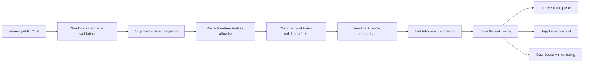
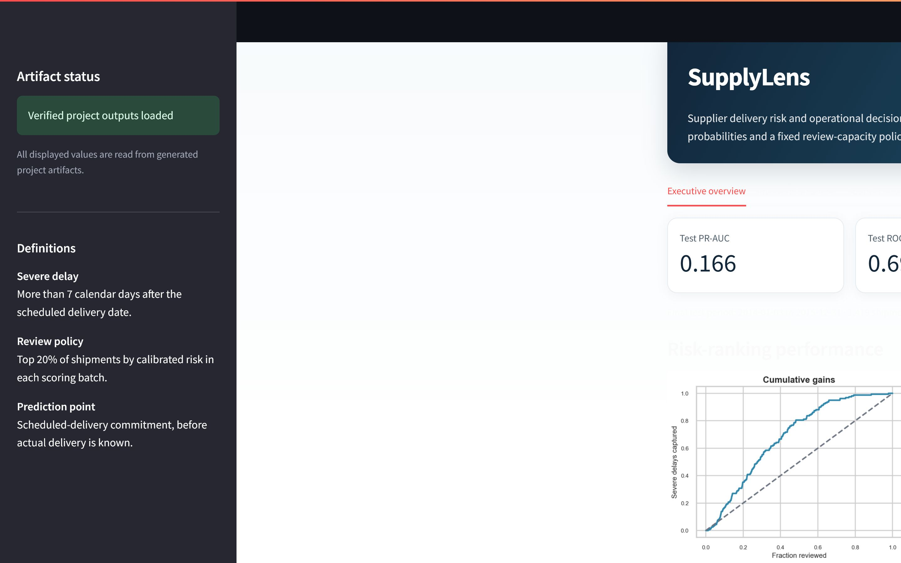

# SupplyLens: Supplier Delivery Risk and Operational Decision Intelligence

**SupplyLens ranks public-health commodity shipments by the calibrated probability of arriving more than seven days late, enabling scarce operational review capacity to focus on the highest-risk cases.**

The business problem is a constrained decision: operations teams cannot investigate every shipment, so a useful model must capture more severe delays than a volume-matched review policy while preserving calibrated risk and a reproducible handoff.

## Why I built this

I built SupplyLens to explore a practical question: when an operations team cannot investigate every shipment, can a risk model help decide which cases deserve attention first? I chose the SCMS data because it contains scheduled and actual delivery dates at a usable shipment grain. My goal was not to chase the highest possible model score; it was to build a workflow I could defend from data acquisition through an operational review queue.



## Verified results

- Final-test ROC-AUC: **0.696**; PR-AUC: **0.166** against **10.8%** prevalence.
- The exact top-20% policy reviewed **296** of **1,479** test shipments, captured **56** severe delays, and achieved **1.76× lift**.
- Top-20% precision was **18.9%** and recall was **35.2%**; probabilities achieved test Brier **0.096** after **isotonic** calibration.
- Logistic regression was retained because histogram gradient boosting did not clear the predeclared 0.01 validation PR-AUC improvement margin.
- The learned P50 lead-time model was rejected: test MAE **4.44 days** versus **0.70 days** for scheduled lead time.



### Main operational outputs

- `reports/tables/shipment_intervention_queue.csv` — ranked final-test queue with review flags and local contributors for the highest ranks.
- `reports/tables/supplier_scorecard.csv` — test-period supplier decision support with minimum-volume eligibility.
- `reports/tables/replenishment_risk_indicators.csv` — historical quantity and lead-time variability scenarios, not inventory recommendations.

**Technology:** Python 3.11 · pandas · scikit-learn · NumPy · SciPy · Matplotlib · Seaborn · Plotly · Streamlit · pytest · Jupyter

## Business problem and decisions supported

SupplyLens supports shipment-review prioritization, supplier delivery-performance investigation, lead-time variability analysis, review-capacity planning, and monitoring design. It does not automate supplier penalties, inventory decisions, transport changes, or causal conclusions.

The prediction unit is an ASN/DN shipment. Scoring occurs at scheduled-delivery commitment, before actual delivery. A severe delay is actual delivery strictly more than seven calendar days after schedule.

## Dataset

The selected source is the U.S. Agency for International Development Supply Chain Shipment Pricing / SCMS Delivery History dataset. The original publisher asset is no longer directly retrievable, so the project uses a commit-pinned public mirror and verifies SHA-256 `918b992dd3e8d4b64d2a727b2c4ea607603d0c58f19484e73f7b78528c6a8673`.

- 10,324 source shipment lines and 33 source columns.
- 7,030 ASN/DN shipments after reproducible aggregation.
- Scheduled deliveries from 2006-05-02 to 2015-12-31.
- 509 severe-delay shipments (7.24%).

The accessible mirror does not state an explicit data license, so the raw CSV is not redistributed. See [data provenance](docs/DATA_PROVENANCE.md) and the [source comparison](docs/DATA_SOURCE_REVIEW.md).

## Data quality and leakage controls

Validation checks checksum, shape, schema, identifiers, dates, numeric ranges, duplicates, sequence anomalies, and categories. Three recorded-before-delivery rows and four shipments more than 365 days early are retained as warnings. Raw data is never modified.

The model uses an explicit prediction-time allowlist. Actual delivery, delivery-recorded date, calculated delay, outcome status, and target columns are blocklisted. Historical target rates are implemented and tested but excluded from production because the source lacks the exact schedule-entry timestamp. See [feature availability](docs/FEATURE_AVAILABILITY.md).

## Methodology

1. Validate the immutable raw file and aggregate shipment lines by ASN/DN.
2. Compare target thresholds of more than 0, 3, 7, and 14 days late.
3. Create categorical and log-scaled numeric features available at schedule commitment.
4. Split chronologically: train **2006-05-02–2012-12-31**, validation **2013-01-02–2013-12-31**, final test **2014-01-03–2015-12-31**.
5. Compare prevalence, supplier-rate, logistic-regression, and histogram-gradient-boosting models.
6. Select calibration on validation Brier score.
7. Evaluate the chosen system once on the final period and rank by fixed review capacity.

## Decisions I made

- I defined severe delay as more than seven days late after comparing 0, 3, 7, and 14-day thresholds. Seven days kept 509 positive cases while representing a material delivery miss.
- I treated scheduled-delivery commitment as the scoring point and excluded actual delivery, calculated delay, and shifted target-history features when timestamp availability could not be guaranteed.
- I retained logistic regression when histogram gradient boosting failed to improve validation PR-AUC by the predeclared 0.01 margin.
- I selected an exact top-20% review policy because the use case is capacity constrained; a generic 0.50 probability threshold was not operationally relevant.

## Model comparison

| Validation model | ROC-AUC | PR-AUC | Brier |
|---|---:|---:|---:|
| Prevalence Baseline | 0.500 | 0.095 | 0.088 |
| Supplier Rate Rule | 0.644 | 0.138 | 0.088 |
| Logistic Regression | 0.746 | 0.198 | 0.161 |
| Hist Gradient Boosting | 0.739 | 0.187 | 0.140 |

Calibration reduced validation Brier from 0.161 uncalibrated to 0.079 with isotonic mapping. Because the same validation year fits and compares calibrators, its near-zero validation calibration error is optimistic; untouched-test calibration error is **0.036**.

## Operating policy

The selected policy reviews the exact top 20% per batch with stable rank tie-breaking. On final test it produced precision **18.9%**, recall **35.2%**, lift **1.76×**, and **103** false negatives. Capacity results for 5%, 10%, 20%, and 30% are generated in `reports/tables/capacity_analysis_test.csv`.

The financial calculator is explicitly assumption-based. Its configured review cost, missed-delay exposure, and intervention-success rate are not observed business values or realized savings.

## Dashboard

The Streamlit dashboard reads only generated artifacts and includes the executive overview, intervention queue, supplier scorecard, model/calibration analysis, capacity tradeoffs, segment errors, retrospective drift examples, and limitations.

```bash
python -m streamlit run app/app.py
```

## Repository structure

```text
configs/        Configuration and business thresholds
data/           Source documentation; local raw and processed data
notebooks/      Executed canonical end-to-end notebook
src/supplylens/ Reusable data, feature, model, scoring, and monitoring modules
scripts/        Download, validate, train, score, report, and audit commands
app/            Streamlit dashboard
tests/          Data, leakage, temporal, model, and scoring tests
models/         Reproducible local model artifact
reports/        Generated figures, metrics, tables, and notebook HTML
docs/           Provenance, assumptions, model card, contract, and deployment design
```

## Installation and reproducibility

Python 3.11 is the supported environment.

```bash
python -m venv .venv
source .venv/bin/activate
python -m pip install -r requirements.txt
python -m pip install -e .
python scripts/download_data.py
python scripts/validate_data.py
python scripts/train.py
python scripts/build_reports.py
python scripts/build_readme.py
python -m pytest
```

Windows PowerShell:

```powershell
py -3.11 -m venv .venv
.\.venv\Scripts\python.exe -m pip install -r requirements.txt
.\.venv\Scripts\python.exe -m pip install -e .
.\.venv\Scripts\python.exe scripts\download_data.py
.\.venv\Scripts\python.exe scriptsalidate_data.py
.\.venv\Scripts\python.exe scripts	rain.py
.\.venv\Scripts\python.exe scriptsuild_reports.py
.\.venv\Scripts\python.exe scriptsuild_readme.py
.\.venv\Scripts\python.exe -m pytest
```

Equivalent `make` targets are `install`, `download-data`, `validate-data`, `train`, `reports`, `test`, `notebook`, `dashboard`, and `validate-project`.

## Scoring

```bash
python scripts/score.py --input path/to/shipments.csv --output path/to/scored_shipments.csv
```

The command validates the [scoring contract](docs/SCORING_CONTRACT.md), rejects outcome fields, loads the complete saved bundle, produces calibrated probabilities, assigns stable risk ranks, and flags the exact selected capacity.

## Notebook

```bash
python scripts/build_notebook.py
python -m jupyter nbconvert --to notebook --execute --inplace --ExecutePreprocessor.timeout=900 notebooks/SupplyLens_End_to_End_Project.ipynb
python -m jupyter nbconvert --to html --output-dir reports/html notebooks/SupplyLens_End_to_End_Project.ipynb
```

## Testing

```bash
python -m pytest
python scripts/validate_project.py
```

Continuous integration downloads the checksum-pinned 3.79 MB source, runs lightweight validation, linting, and tests, but does not retrain the full model on every commit.

## What I learned

- A more complex classifier was not automatically better; logistic regression was the stronger recommendation for this dataset.
- The learned P50 lead-time model performed worse than the schedule baseline, so I preserved the negative result instead of presenting it as deployable.
- Temporal validation mattered: prevalence and calibration changed across periods, making review capacity and drift monitoring as important as one headline AUC.
- Small implementation details mattered operationally. Isotonic probability ties required stable rank-based selection to keep the queue at exactly the configured capacity.

## Limitations and responsible use

- Historical program data may not generalize to current networks.
- The target rate changes materially across time.
- The model's PR-AUC is modest; human review remains essential.
- Supplier identity can proxy geography, portfolio, and program structure.
- Scorecards are decision support, not automatic penalty systems.
- Replenishment outputs lack current inventory and are historical indicators only.
- Propensity diagnostics show limited overlap and residual imbalance; no causal effect is claimed.

See the [model card](docs/MODEL_CARD.md), [business assumptions](docs/BUSINESS_ASSUMPTIONS.md), and [deployment and monitoring design](docs/DEPLOYMENT_AND_MONITORING.md).

## Author

**Sagar Pandya**

I built this project as an end-to-end study of how predictive modeling can support constrained operational decisions. The decisions, results, and limitations above are tied to the executed artifacts in this repository.

Project code is available under the MIT License. Source data retains its own usage status.
