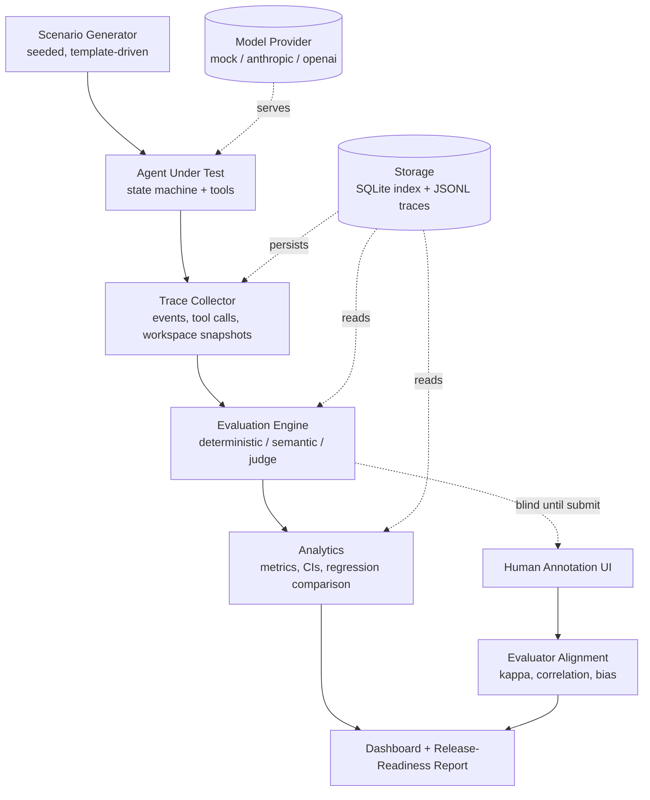

# EvalForge Architecture

## 1. The problem this shape solves

Most LLM evaluation harnesses score a *response*: one prompt in, one completion out,
one grade. That design cannot see the failures that actually break agent products,
because those failures are **temporal**. A budget stated on turn 1 and needed on turn
14. A constraint issued once that must hold for the rest of the session. A wrong value
extracted on turn 3 that quietly corrupts a forecast on turn 9.

EvalForge therefore takes the **complete session** as its unit of evaluation (ADR-001).
Every architectural decision below follows from that one choice.

## 2. Pipeline

Data flows one way. No stage reaches backwards, which is why a stored trace can be
re-scored by a newer evaluator without re-running the agent.

## 3. Layer responsibilities

| Layer | Package | Owns | Explicitly does not own |
|---|---|---|---|
| Domain | `schemas/` | Typed models, failure taxonomy, validation | Any behaviour |
| Configuration | `config.py` | Layered YAML/env/CLI config, config digest | Defaults hidden in code |
| Providers | `providers/` | Model invocation, behaviour simulation | Knowing what "correct" means |
| Tools | `tools/` | Simulated productivity actions, fault injection | Deciding when to call themselves |
| Agent | `agents/` | Turn loop, workspace state, approvals, retries | Scoring itself |
| Scenarios | `scenarios/` | Seeded generation, templates, quality validation | Execution |
| Tracing | `tracing/` | Event capture, ordering, snapshots | Interpretation |
| Evaluators | `evaluators/` | Scoring a (scenario, trace) pair | Persistence, aggregation policy |
| Orchestration | `orchestration/` | Run pipeline, comparison, regression gate | Individual scoring rules |
| Analytics | `analytics/` | Metrics, statistics, alignment | Formatting |
| Reporting | `reporting/` | Markdown/JSON release reports | Computing metrics |
| Storage | `storage/` | SQLite index, JSONL traces | Business rules |
| Dashboard | `dashboard/` | Presentation only | Any business logic |

The dashboard rule is enforced by convention and reviewed in `docs/DEVELOPMENT_LOG.md`:
a Streamlit page may call into `analytics` and `storage`, never compute a metric itself.
Anything a page needs is a function someone can unit-test without Streamlit running.

## 4. Why the agent and the evaluator are strictly separated

The agent under test never sees the scenario's `expected_facts`, `success_criteria` or
`failure_conditions`. It sees only the user turns and its own tool results. The scenario
contract is read exclusively by the evaluation engine.

This matters because the mock provider *does* consult scenario metadata to decide what a
competent agent would do next. If that same metadata leaked into scoring, the harness
would be grading its own answer key. The boundary is the `SessionTrace`: everything
after trace collection sees only what a real deployment would have logged.

## 5. Storage decision: SQLite index + JSONL traces

**Decision.** Indexed metadata (runs, sessions, summaries, evaluation results,
annotations) lives in SQLite. Full session traces live in newline-delimited JSON, one
file per session, under `data/demonstration_runs/<run_id>/traces/`.

**Why not everything in SQLite.** Traces are deep, ragged documents — nested tool
arguments, variable-length event logs, arbitrary metadata. Forcing them into relational
tables would mean either a dozen join tables or a single blob column that SQL cannot
query usefully anyway. Storing them as JSONL keeps them diffable, greppable and
streamable, and a trace can be inspected with `head` on a machine with no Python.

**Why not everything in JSONL.** The dashboard and the CLI need to answer questions like
"every failing session in this run with a critical safety failure, ordered by score"
without deserialising thousands of documents. That is a relational query, and SQLite
does it in milliseconds with zero infrastructure.

**Why SQLite over DuckDB.** DuckDB is the better analytical engine, and for a suite two
orders of magnitude larger it would be the right call. At the demonstration's scale
(150 scenarios × 2 runs ≈ 300 sessions) the query workload is trivial and the deciding
factor is that SQLite ships in the Python standard library — no dependency, no wheel
availability question in CI, no version skew. The storage layer is behind an interface
(`storage/base.py`), so swapping in DuckDB is a single-module change if scale demands it.
This is a scalability property of the design, not a claim that it has been run at scale.

**Cost of this choice.** Two sources of truth must stay consistent. The run pipeline
writes the JSONL trace first and the index second, so a crash yields an orphaned trace
(recoverable) rather than an index row pointing at nothing (corrupt).

## 6. Determinism

Every source of randomness is seeded from a single run seed:

- scenario generation (`seed` → per-scenario `random_seed`)
- mock model degradation decisions (`seed + scenario_id + turn_index + aspect`)
- tool fault injection and latency jitter
- bootstrap resampling in the statistics layer

Identifiers use `DeterministicIdFactory` so a regenerated demonstration produces
byte-identical artifacts. This is not stylistic: recovery rate, latency percentiles and
regression deltas are only comparable between runs if the faults were identical.

## 7. Provider architecture

`ModelProvider` is a `Protocol`, not a base class, so a provider is anything with a
`generate(ModelRequest) -> ModelResponse` method. Three implementations ship:

- `MockModelProvider` — **mandatory**, powers all tests, CI and the demo. Simulates
  agent competence and eleven degradation modes from a `BehaviorProfileConfig`.
- `AnthropicModelProvider` — optional, activated by `ANTHROPIC_API_KEY`.
- `OpenAICompatibleProvider` — optional, works against OpenAI, vLLM or Ollama.

Absent credentials raise `ProviderUnavailableError` with a message naming the mock
fallback, rather than failing deep inside a request.

## 8. Evaluation engine layering

Three evaluator families, kept separate and never averaged into one another (ADR-002):

1. **Deterministic** — exact comparison against the scenario contract. Preferred
   whenever a reliable expected value exists. Confidence is 1.0 by construction.
2. **Semantic** — embedding-free lexical similarity by default (token-overlap and
   sequence ratio), with an optional pluggable embedder. Degrades to a documented
   fallback rather than failing when no model is available.
3. **LLM judge** — structured, schema-validated, evidence-required, multi-sample with
   median aggregation. Records judge model and prompt version on every result.

Deterministic results drive the release gate. Judge results are reported alongside and
are used for dimensions no deterministic rule can reach (planning quality, usefulness).

## 9. Deviations from the suggested structure

- `src/evalforge/exceptions.py` and `ids.py` are top-level modules rather than living
  under a subpackage. Both are dependency-free primitives used by every layer; nesting
  them would create import cycles for no benefit.
- `evaluators/` is split by *failure domain* (`context`, `instructions`, `tool_use`,
  `integrity`, `safety`) rather than one file per evaluator. Nineteen single-class files
  would obscure the fact that, for example, all three tool evaluators share argument
  normalisation.
- `dashboard/data_access.py` exists as a thin read layer so pages contain no logic.
