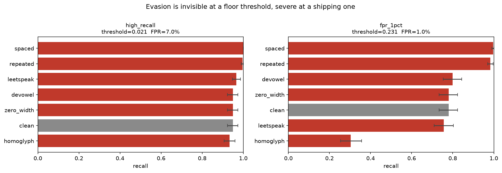

# The evasion gap

**Does an off-the-shelf toxicity classifier survive trivial obfuscation?**

Yes at the operating point most write-ups measure at, and no at the one a platform
actually ships. The gap between those two answers is the project.

`unitary/toxic-bert` · 300 toxic + 300 benign comments from `civil_comments` ·
7 evasion transforms · bootstrap CIs over 2000 resamples

---

## Result

> **Swapping eight Latin characters for Cyrillic lookalikes cuts recall from 0.780 to
> 0.303 — a 61% relative loss.** The text is unchanged to a human reader. The attack is a
> 9-line dictionary lookup.

### At a 1% false-positive budget — what ships

Threshold 0.2305, benign FPR 1.0%.

| attack | recall | 95% CI | recall drop |
|---|---|---|---|
| **homoglyph** | **0.303** | [0.253, 0.357] | **0.477** |
| leetspeak | 0.757 | [0.710, 0.803] | 0.023 |
| clean | 0.780 | [0.733, 0.823] | — |
| zero_width | 0.780 | [0.733, 0.823] | 0.000 |
| devowel | 0.800 | [0.753, 0.843] | −0.020 |
| repeated | 0.983 | [0.970, 0.997] | −0.203 |
| spaced | 0.997 | [0.990, 1.000] | −0.217 |

### At a threshold pinned to 95% recall — what hides the problem

Threshold 0.0213, benign FPR 7.0%.

| attack | recall | 95% CI | recall drop |
|---|---|---|---|
| homoglyph | 0.933 | [0.907, 0.960] | 0.017 |
| clean | 0.950 | [0.923, 0.973] | — |
| zero_width | 0.950 | [0.923, 0.973] | 0.000 |
| devowel | 0.950 | [0.923, 0.973] | 0.000 |
| leetspeak | 0.967 | [0.947, 0.987] | −0.017 |
| repeated | 0.997 | [0.990, 1.000] | −0.047 |
| spaced | 1.000 | [1.000, 1.000] | −0.050 |



---

## Findings

**1. Homoglyph substitution is the only attack that works — and it works completely.**
Recall 0.780 → 0.303 at a shipping threshold. Mean score collapses 0.605 → 0.214. Cyrillic
`а е о` are distinct codepoints from Latin `a e o`, so every token containing one falls out
of vocabulary and the model scores what is effectively a different language.

**2. The operating point decides whether you can see the problem at all.**
The same attack on the same data reads as a **0.017** drop at a 95%-recall threshold and a
**0.477** drop at a 1%-FPR threshold — a 28× difference in apparent severity.

Pinning the threshold on recall is the intuitive choice and it is actively misleading here.
The toxic score distribution has a long left tail, so a 0.95 target drives the threshold to
**0.021**, essentially the floor. At that point almost nothing is rejected, recall becomes
insensitive to anything the attack does, and the FPR is 7% — which no platform would run.
This is the reason to pick the operating point from the false-positive budget first.

*My first run measured only at the 95%-recall point and concluded the model was robust. It
isn't. The tell was `homoglyph` showing a 0.017 recall drop while its mean score fell by
two-thirds — a metric that cannot move is not evidence of safety.*

**3. `zero_width` is not defended, it is deleted.**
Its scores are identical to clean at three decimals, which is too clean to be robustness.
BERT's text cleaning strips category-`Cf` codepoints before tokenization, so the zero-width
spaces never reach the model. A defense exists — it is just incidental, inherited from a
2018 preprocessing decision rather than chosen. Nothing guarantees the next tokenizer keeps it.

**4. `spaced` and `repeated` make the model *more* confident, and that is a defect.**
Recall rises to 0.997 and 0.983, well above clean. The model appears to treat character
fragmentation and vowel repetition as toxicity signals in themselves — plausibly learned
from Jigsaw, where `s o   a n g r y` and `whyyyy` correlate with abusive comments. That is
not robustness. It predicts that emphatic-but-benign text gets over-flagged, which is a
false-positive problem affecting real users. Measuring it is the next experiment (below).

---

## Why this framing

| Conventional | Here |
|---|---|
| Accuracy / F1 / ROC-AUC | Recall at thresholds pinned to an explicit budget |
| One threshold, usually 0.5 | Two operating points, because they disagree |
| Point estimates | Bootstrap CIs — 300 rows carries real noise |
| Confusion matrix | Which *kind* of obfuscation wins, and what it did to the tokenizer |

Thresholds never move between attacks. That is the experiment: an operating point chosen
on clean data is what actually ships.

---

## Threat model

The adversary wants abusive text to stay readable to humans while scoring below the
moderation threshold. No model access, no gradients, no ML — a keyboard and a Unicode
table. Every attack is a pure string transform under ten lines.

| attack | transformation | example |
|---|---|---|
| `homoglyph` | Latin → visually identical Cyrillic | `idiot` → `іdіоt` |
| `leetspeak` | `a→4 e→3 i→1 o→0 s→5 t→7` | `idiot` → `1d107` |
| `zero_width` | zero-width space between every character | `idiot` → `i​d​i​o​t` |
| `spaced` | character spacing | `idiot` → `i d i o t` |
| `repeated` | vowel repetition | `idiot` → `iiidiiiooot` |
| `devowel` | drop vowels after each word's first char | `idiot` → `idt` |

Readability is a hard constraint, enforced in `tests/`. A transform that mangles text past
human comprehension is not an evasion — it is noise, and it does not belong in the suite.

---

## Quickstart

```bash
pip install -r requirements.txt
```

```bash
python scripts/run_experiment.py --config config.yaml
```

Writes `results/sweep.csv`, `results/operating_points.json`, `results/robustness.png`.
CPU is fine. The corpus is streamed rather than downloaded, which is the slow step
(~5 min to find 300 rows above the toxicity cutoff); on stream failure the loader degrades
to a small built-in sample so a run always completes, and numbers from that fallback are a
pipeline check, not a result.

Narrative version, with score distributions, tokenizer inspection, and a normalization defense:

```bash
jupyter lab notebooks/01_evasion_gap.ipynb
```

```bash
pytest -q
```

---

## Layout

```
├── config.yaml                    # model, corpus, both operating points
├── src/evasion_gap/
│   ├── attacks.py                 # the evasion transforms
│   ├── data.py                    # streamed corpus loading + fallback
│   ├── model.py                   # multi-label model → single P(toxic)
│   ├── metrics.py                 # threshold-at-recall, threshold-at-FPR, bootstrap CI
│   ├── pipeline.py                # operating points → sweep orchestration
│   └── plots.py                   # side-by-side result chart
├── scripts/run_experiment.py      # reproducible headless entrypoint
├── notebooks/01_evasion_gap.ipynb # narrative + failure inspection
├── tests/                         # readability + metric invariants
└── results/                       # committed — the numbers are the deliverable
```

---

## Limitations

Single model, single dataset, English only. 300 examples per condition, so recall carries
roughly ±4pp (bootstrap CIs are reported throughout, not hidden). Attacks are hand-written
rather than searched, making these a **lower bound** on what a real adversary achieves.
`civil_comments` toxicity labels are crowd-sourced and carry annotator bias that propagates
into the baseline. The homoglyph map covers 8 characters; a fuller map would likely be worse.

---

## Roadmap

- [ ] **Apply the attacks to the benign set** and measure FPR shift — directly tests finding 4, and is the most load-bearing gap in the current result
- [ ] Unicode normalization (NFKC + homoglyph reversal) as a defense layer; re-measure
- [ ] Adversarial fine-tuning on generated variants, and the clean-FPR cost it incurs
- [ ] Composed attacks (homoglyph + spacing) rather than one transform at a time
- [ ] Text rendered as an image, which defeats the text path entirely
- [ ] Latency and cost per million requests for a normalize → classify cascade

## License

MIT — see [LICENSE](LICENSE).
