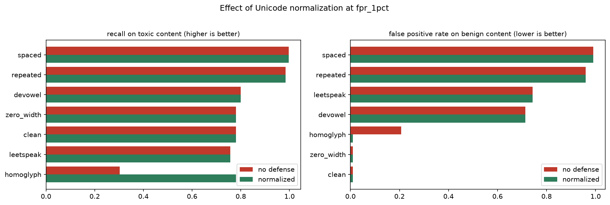
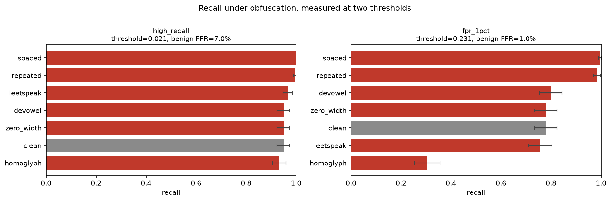

# Adversarial robustness of a toxicity classifier

[Back to the project index](../../README.md)

An evaluation of how `unitary/toxic-bert` behaves when comment text is obfuscated in
ways that a person can still read. The project measures both failure directions,
identifies the cause of each, tests a fix, and reports what the fix does and does not
cover.

**Summary of what was found:** one of the six transformations is a genuine evasion, and
it can be fixed entirely in preprocessing. The other four are a different problem that
had not been visible: they cause the model to flag ordinary, non-toxic comments at up to
99 percent, because the model is reacting to unusual character patterns rather than to
what the comment says.

---

## Why this project

Automated moderation runs at a threshold, and that threshold is chosen on clean data.
People who want to post abusive content do not send clean data. The practical question
for anyone operating such a system is not how accurate the model is on a benchmark, but
how much of its measured performance survives contact with someone actively trying to
get around it, and what it costs to close the gap.

The transformations used here need no model access and no machine learning. Each is a
few lines of string manipulation, which is what makes them worth testing: they represent
the cheapest thing an adversary can do, so anything that fails against them will fail in
production.

## Question

At a threshold a moderation system would actually run at, how much does obfuscation
change the model's behaviour, in both directions, and can it be corrected without
retraining?

Measuring both directions matters. Content that slips past the filter and content that
is wrongly removed are different failures with different costs, and an evaluation that
only scores toxic examples cannot see the second one.

---

## Results

Measured at a threshold set to a 1 percent false positive budget on clean benign text
(threshold 0.2305). 300 toxic and 300 benign comments from `civil_comments`, with
bootstrap confidence intervals over 2000 resamples.

### Recall on toxic content

| transformation | no defense | with normalization |
|---|---|---|
| clean (baseline) | 0.780 | 0.780 |
| **homoglyph** | **0.303** | **0.780** |
| leetspeak | 0.757 | 0.757 |
| zero_width | 0.780 | 0.780 |
| devowel | 0.800 | 0.800 |
| repeated | 0.983 | 0.983 |
| spaced | 0.997 | 0.997 |

### False positive rate on benign content

| transformation | no defense | with normalization |
|---|---|---|
| clean (baseline) | 0.010 | 0.010 |
| zero_width | 0.010 | 0.010 |
| **homoglyph** | **0.207** | **0.010** |
| devowel | 0.713 | 0.713 |
| leetspeak | 0.743 | 0.743 |
| repeated | 0.960 | 0.960 |
| **spaced** | **0.990** | **0.990** |



### Finding 1: homoglyph substitution defeats the model, and normalization fixes it

Replacing eight Latin characters with Cyrillic characters that look identical drops
recall from 0.780 to 0.303, a 61 percent relative loss. The Cyrillic characters are
different codepoints, so the affected tokens are out of vocabulary and the model is
scoring text it has effectively never seen.

A Unicode normalization pass applied before the model restores recall to 0.780 exactly,
and brings the benign false positive rate back from 0.207 to 0.010. This requires no
retraining, no new labelled data, and no change to the served model.

### Finding 2: four of the transformations are not evasions, they are false positive triggers

This only became visible after scoring the benign split, which the first version of this
evaluation did not do.

Spacing out characters raises the false positive rate on ordinary, non-toxic comments
from 1 percent to 99 percent. Vowel repetition raises it to 96 percent, leetspeak to 74
percent, and vowel removal to 71 percent. The recall numbers for these transformations
look fine, and in isolation they suggest robustness. They are not measuring robustness.
The model raises its score for these inputs regardless of what the comment actually
says.

The likely cause is the training data. Jigsaw-style comment corpora contain a
correlation between unusual formatting and abusive content, and the model appears to
have learned the formatting itself as a signal. The practical consequence is that users
who write emphatically get their comments removed.

Normalization does not help here, and should not be expected to: nothing is being
disguised. This needs a training-data intervention rather than a preprocessing one.

### Finding 3: the threshold determines whether any of this is visible

The same homoglyph attack reads as a 0.017 recall drop when the threshold is set to
achieve 95 percent recall, and a 0.477 drop when it is set to a 1 percent false positive
budget.

The reason is that the toxic score distribution has a long lower tail, so targeting 95
percent recall drives the threshold to 0.021. At that threshold almost nothing is
rejected, the measured rate barely responds to the input, and the false positive rate is
7 percent, which is far outside what a moderation system would accept.

The first version of this evaluation used only the recall-pinned threshold and concluded
that the model was robust. That conclusion was wrong. The signal that something was off
was that homoglyph showed a 0.017 recall drop while its mean score fell from 0.605 to
0.214: a large change in the model's output that the metric was not registering.



---

## What this means in operation

The figures below are an illustration using stated assumptions, not a measurement of any
real platform. Assume 1,000,000 comments per day, 2 percent of them genuinely toxic, and
the 1 percent false positive threshold above.

**Evasion.** On clean traffic the model catches 15,600 of the 20,000 toxic comments and
misses 4,400. If an adversary applies homoglyph substitution, it catches 6,060 and misses
13,940. That is roughly 9,500 additional harmful comments per day getting through, from a
change that costs the adversary nothing.

**False positives.** If 1 percent of benign comments are written in an emphatic style
with spaced or repeated characters, that is 9,800 comments per day. At the baseline rate
98 of them would be wrongly flagged. At the measured 99 percent rate, 9,702 are. That is
roughly 9,600 additional wrongful removals per day, affecting users who have done nothing
wrong.

The two failures are comparable in size and only one of them is an attack.

---

## Recommendation

1. **Add Unicode normalization to the preprocessing path.** It fully resolves the
   homoglyph evasion and the associated false positives, costs microseconds per comment,
   requires no retraining, and can be reverted independently of the model.
2. **Do not treat the remaining recall numbers as evidence of robustness.** They are
   produced by a model that raises its score for unusual formatting, which is why the
   same transformations are catastrophic on benign text.
3. **Address the formatting sensitivity in training rather than preprocessing.** The
   model needs benign examples that use emphatic formatting, so that character patterns
   stop acting as a proxy for abuse.
4. **Set the evaluation threshold from the false positive budget, and score both
   splits.** Neither finding here is visible under a recall-pinned threshold on toxic
   examples alone.

---

## Data

`civil_comments` via streaming, filtered to human-rated toxicity of at least 0.8 for the
toxic split and at most 0.1 for the benign split, 300 comments each, capped at 1000
characters. The corpus is cached to `data/` after the first run.

The benign split is not optional. It sets the threshold, and it is where the second
finding came from.

## Method

1. Score both clean splits and use the distributions to set two thresholds, one pinned to
   95 percent recall and one pinned to a 1 percent false positive budget.
2. Apply each of the six transformations to both splits.
3. Score each variant twice, once as-is and once through the normalization pass.
4. Measure the rate above each threshold, with bootstrap confidence intervals.

Thresholds are held fixed across every condition, since a threshold chosen on clean data
is what a deployed system would be using.

### Transformations tested

| name | change | example |
|---|---|---|
| `homoglyph` | Latin to Cyrillic look-alikes | `idiot` to `іdіоt` |
| `leetspeak` | letters to digits | `idiot` to `1d107` |
| `zero_width` | zero-width space between characters | `idiot` to `i​d​i​o​t` |
| `spaced` | characters separated by spaces | `idiot` to `i d i o t` |
| `repeated` | vowels repeated | `idiot` to `iiidiiiooot` |
| `devowel` | vowels removed after first character | `idiot` to `idt` |

`zero_width` has no effect on the model in either direction. Its scores are identical to
clean text because BERT's tokenizer removes Unicode category Cf characters before
tokenization, so the inserted characters never reach the model. The protection is real
but incidental, and it depends on a tokenizer preprocessing detail rather than on a
deliberate decision.

---

## Reproducing

```bash
pip install -r requirements.txt
```

```bash
python scripts/run_experiment.py --config config.yaml
```

Writes `sweep.csv`, `operating_points.json` and two charts to `results/`. Runs on CPU.
The first run streams the corpus, which takes about five minutes because comments above
the toxicity cutoff are rare; later runs use the cache in `data/`.

```bash
jupyter lab notebooks/01_evasion_gap.ipynb
```

The notebook covers the same run with the score distributions, the tokenizer comparison
behind finding 1, and the threshold analysis behind finding 3.

```bash
pytest -q
```

46 tests, covering the properties of each transformation, the threshold functions, and
the claim that normalization reverses the homoglyph and zero-width transformations.

## Layout

```
config.yaml                      model, corpus and threshold settings
src/evasion_gap/
    attacks.py                   the six transformations
    defense.py                   Unicode normalization pass
    data.py                      corpus streaming and caching
    model.py                     classifier wrapper
    metrics.py                   threshold selection, rates, bootstrap intervals
    pipeline.py                  sweep orchestration
    plots.py                     charts
scripts/run_experiment.py        command line entry point
notebooks/01_evasion_gap.ipynb   analysis with commentary
tests/                           46 tests
results/                         committed output
```

## Limitations

One model, one dataset, English only. 300 examples per condition gives roughly plus or
minus 4 percentage points on each rate; confidence intervals are in `results/sweep.csv`.

The transformations are hand-written rather than searched, so the recall loss reported
here is a lower bound on what an adversary could achieve. The homoglyph map covers eight
characters and a fuller one would likely do more damage.

`civil_comments` toxicity labels are crowd-sourced and carry annotator bias, which
propagates into the thresholds since they are derived from that labelling.

The operational figures are an illustration under stated assumptions. Real traffic mix,
toxicity base rate and adoption of any given obfuscation would all change them.

## Next steps

- Search for transformations rather than hand-writing them, to get a tighter bound on the
  evasion risk
- Retrain with emphatically formatted benign examples and measure whether the formatting
  sensitivity in finding 2 goes away
- Test transformations in combination rather than one at a time
- Measure text rendered as an image, which bypasses the text path completely
- Measure added latency and cost per million comments for the normalization step

## License

MIT, see [LICENSE](LICENSE).
