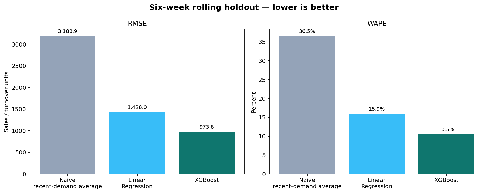
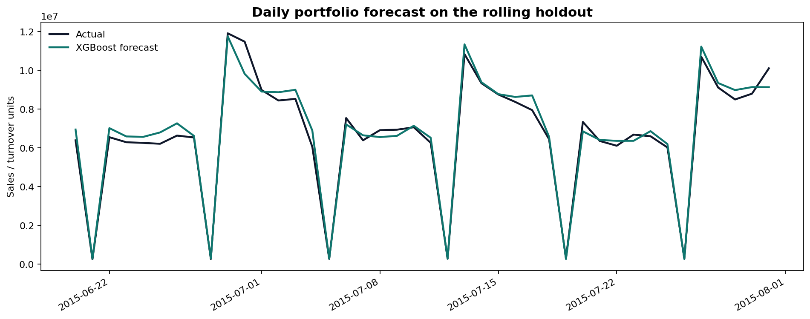
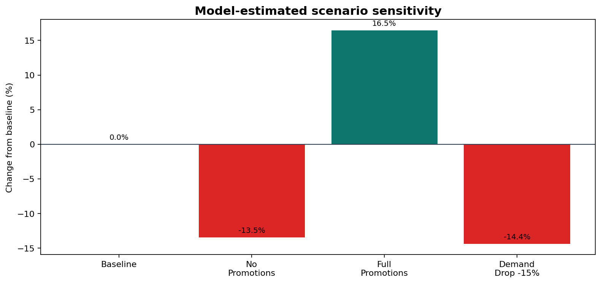

# Store-Level Revenue Forecasting and Scenario Planning

[](https://github.com/SaguPandya96/Data-Science-/actions/workflows/store-revenue-forecasting-tests.yml)


Can a finance team forecast daily store sales better than a recent-demand planning rule, then use the same model to test operating assumptions?

On the final six-week rolling holdout, XGBoost reduced RMSE by **69.5%** versus the seven-day demand baseline and **31.8%** versus linear regression. It reached **10.51% WAPE**, **1.65% forecast bias**, and **0.932 R²** across 46,830 store-days.

The answer is useful, but bounded: this is a rolling one-day-ahead forecast. Promotion scenarios describe model sensitivity, not causal promotion ROI.

The Rossmann field is named `Sales` and represents daily turnover. This project uses “revenue forecasting” as planning shorthand; the source does not provide margin, costs, or a documented currency.

## What shipped

- checksum-pinned ingestion for 1,017,209 daily observations and 1,115 stores;
- schema checks and a many-to-one store metadata contract;
- strictly shifted 7-day and 30-day store demand features;
- naive, linear, and XGBoost model comparison on a chronological holdout;
- store, promotion, and weekday error tables;
- baseline, promotion, and demand-shock scenario planning;
- a saved preprocessing/model pipeline and a one-day-ahead scoring CLI;
- training-distribution monitoring artifacts;
- deterministic sample data, automated tests, and GitHub Actions CI; and
- an original research notebook plus a clean package-driven walkthrough.

## Verified full-data result

The table below comes from `config.yaml`, not the synthetic demonstration data.

| Model | RMSE | MAE | WAPE | Forecast bias | R² |
|---|---:|---:|---:|---:|---:|
| Recent-demand baseline | 3,188.93 | 2,192.45 | 36.52% | −0.48% | 0.268 |
| Linear regression | 1,428.03 | 955.95 | 15.92% | 3.71% | 0.853 |
| **XGBoost** | **973.81** | **630.99** | **10.51%** | **1.65%** | **0.932** |



The daily aggregate view shows where the portfolio forecast follows the holdout and where error remains.



Reference tables are checked into [`reports/reference/`](reports/reference/) so readers can inspect the measured result without downloading data or retraining.

## Scenario planning

| Scenario | Forecasted turnover | Change from baseline |
|---|---:|---:|
| Baseline | 285.7M | — |
| No promotions | 247.2M | −13.50% |
| Full promotions | 332.8M | +16.48% |
| Demand shock −15% | 244.5M | −14.42% |



These movements are associations learned by the model. They are useful for planning ranges, but they do not establish incremental lift, margin impact, or causal ROI.

## Forecast contract

Version 1 predicts one store for one future day:

1. actual sales through day `t-1` are finalized;
2. lag features are refreshed using only those actuals;
3. planned day-`t` operating status, holidays, and promotions are supplied; and
4. the model predicts day `t` turnover.

Every rolling demand feature applies `Sales.shift(1)` within store. `Customers` is excluded because realized traffic is not known before prediction.

The six-week holdout therefore represents repeated daily forecasts. It is not a single six-week forecast created at the cutoff. See [docs/FORECASTING_CONTRACT.md](docs/FORECASTING_CONTRACT.md) and [docs/SCORING_CONTRACT.md](docs/SCORING_CONTRACT.md).

## Quick start

Windows PowerShell:

```powershell
py -3.11 -m venv .venv
.venv\Scripts\Activate.ps1
python -m pip install --upgrade pip
python -m pip install -e ".[dev]"
python scripts/generate_sample_data.py
python run_pipeline.py --config config.sample.yaml
python score_forecast.py --config config.sample.yaml --future data/sample/future.csv
python -m pytest
```

macOS or Linux:

```bash
python3.11 -m venv .venv
source .venv/bin/activate
python -m pip install --upgrade pip
python -m pip install -e ".[dev]"
python scripts/generate_sample_data.py
python run_pipeline.py --config config.sample.yaml
python score_forecast.py --config config.sample.yaml --future data/sample/future.csv
python -m pytest
```

The sample run trains a small random forest for speed while exercising the same ingestion, feature, evaluation, scenario, reporting, persistence, and scoring paths used by the full configuration. Its metrics are a plumbing check, not a business result.

## Run the full Rossmann analysis

```bash
python run_pipeline.py --config config.yaml
```

The first run downloads `train.csv` and `store.csv` from the public mirror referenced by the original notebook. Both files are verified against SHA-256 values in `config.yaml`; later runs verify the cached copies before reading them.

To review and intentionally refresh a changed source:

```bash
python run_pipeline.py --config config.yaml --force-download
```

Never update a configured checksum only to silence a failure. Review the source diff and provenance first.

## Score the next operating day

After training, supply actual history, store metadata, and one future operating-plan date:

```bash
python score_forecast.py \
  --config config.yaml \
  --future path/to/future_plan.csv \
  --output data/processed/future_predictions.csv
```

`--history`, `--stores`, and `--model` default to the configured training paths and saved model. The command rejects multiple future dates because recursive multi-day prediction is outside the version 1 contract.

## Notebooks

- [`01_package_walkthrough.ipynb`](notebooks/01_package_walkthrough.ipynb) runs the package, artifacts, figures, and future scoring on temporary sample outputs.
- [`Store_Level_Revenue_Forecasting_and_Scenario_Planning.ipynb`](notebooks/Store_Level_Revenue_Forecasting_and_Scenario_Planning.ipynb) preserves the original narrative EDA, feature importance, SHAP analysis, and project history.

Rebuild the deterministic walkthrough after editing its source script:

```bash
python scripts/build_walkthrough_notebook.py
```

## Repository layout

```text
data/
  raw/                  checksum-verified source cache, not committed
  sample/               deterministic history, store metadata, and future plan
  processed/            generated holdout and future predictions
docs/                   data, forecast, scoring, model, and monitoring contracts
models/                 generated fitted pipeline
notebooks/              clean walkthrough and original research notebook
reports/
  figures/              portfolio charts generated by the pipeline
  metrics/              generated model, scenario, monitoring, and run metadata
  reference/            checked-in full-data result tables
  tables/               generated segment errors and feature importance
scripts/                 sample-data and walkthrough builders
src/store_revenue_forecasting/
                         ingestion, features, models, scoring, scenarios, reporting
tests/                   unit, leakage, scoring, and end-to-end tests
config.yaml              full Rossmann/XGBoost run
config.sample.yaml       fast local and CI run
run_pipeline.py          training and evaluation entry point
score_forecast.py        one-day-ahead scoring entry point
```

## Generated outputs

| Artifact | Purpose |
|---|---|
| `models/forecasting_pipeline.joblib` | fitted preprocessing and production estimator |
| `reports/metrics/model_performance.csv` | holdout comparison |
| `reports/metrics/scenario_summary.csv` | scenario totals and deltas |
| `reports/metrics/monitoring_baseline.json` | training feature distributions |
| `reports/metrics/run_metadata.json` | row counts, periods, sources, and contract |
| `reports/tables/scenario_daily.csv` | store/day predictions for each scenario |
| `data/processed/holdout_predictions.csv` | actual and predicted holdout values |
| `data/processed/future_predictions.csv` | next-day scoring output |
| `reports/tables/*_error.csv` | store, promotion, and weekday WAPE, bias, and MAE |
| `reports/tables/feature_importance.csv` | model usage when supported by the estimator |
| `reports/figures/*.png` | model, scenario, and holdout charts |

## Honest limitations

- The default evaluation measures rolling one-day-ahead performance, not a one-shot multi-week horizon.
- Promotion scenarios are model sensitivities, not causal treatment effects.
- Store ID is predictive but not an actionable business lever.
- The target is turnover, not profit, margin, units, or cash receipts.
- Version 1 has no prediction intervals.
- New stores require a governed cold-start policy because scoring currently requires prior sales.
- The GitHub data mirror is reproducible and checksum-pinned, but still not an approved production feed.

Read [docs/MODEL_CARD.md](docs/MODEL_CARD.md) and [docs/MONITORING_AND_DEPLOYMENT.md](docs/MONITORING_AND_DEPLOYMENT.md) before using forecasts in staffing, inventory, or finance workflows.

## Project history

This project is the production-oriented migration of `Store_Level_Revenue_Forecasting_and_Scenario_Planning.ipynb` from the `Data-Science-Project-` repository. The original repository remains unchanged so its history and portfolio link stay valid.
