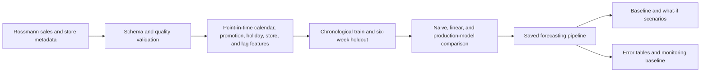

# Store-Level Revenue Forecasting and Scenario Planning

[Back to the project index](../../README.md)

An end-to-end forecasting project that turns the original analysis notebook into a reproducible pipeline for store-level daily sales planning. It downloads and validates Rossmann data, creates point-in-time features, uses a chronological holdout, compares planning baselines, trains a configurable production model, generates what-if scenarios, and saves model and monitoring artifacts.

The Rossmann field is named `Sales` and represents daily turnover. This project treats it as a revenue proxy; the source does not provide margin, costs, or a documented currency.

## What this project answers

- Can a driver-based model outperform a recent-demand planning rule?
- Which forecast-time signals help explain store-level variation?
- How does the model estimate sales under promotion and demand-shock assumptions?
- What artifacts and controls are needed to rerun and monitor the forecast?

## System design



## Forecast contract

This is a **rolling one-day-ahead forecast** refreshed after each day's actual sales arrive. The 7-day and 30-day rolling features always use `Sales.shift(1)` within a store, so the current row never sees its own target.

The six-week holdout evaluates repeated daily forecasts. It is not a single six-week forecast generated at the cutoff. A one-shot multi-week use case would require recursive predictions or lag features frozen at the forecast origin. See [docs/FORECASTING_CONTRACT.md](docs/FORECASTING_CONTRACT.md).

## Repository layout

```text
data/
  raw/                  downloaded source files, not committed
  sample/               deterministic CI and quick-start data
  processed/            generated holdout predictions
docs/                   contracts, data definitions, model card, monitoring
models/                 generated fitted pipeline
notebooks/              original portfolio analysis notebook
reports/
  metrics/              model and scenario metrics
  tables/               segment errors and feature importance
scripts/                 deterministic sample-data builder
src/store_revenue_forecasting/
                         production pipeline modules
tests/                   unit and end-to-end smoke tests
config.yaml              full Rossmann/XGBoost run
config.sample.yaml       fast local and CI run
run_pipeline.py          command-line entry point
```

## Quick start with sample data

Windows PowerShell:

```powershell
py -3.11 -m venv .venv
.venv\Scripts\Activate.ps1
python -m pip install --upgrade pip
python -m pip install -e ".[dev]"
python scripts/generate_sample_data.py
python run_pipeline.py --config config.sample.yaml
python -m pytest
```

macOS or Linux:

```bash
python3.11 -m venv .venv
source .venv/bin/activate
python -m pip install --upgrade pip
python -m pip install -e ".[dev]"
python scripts/generate_sample_data.py
python run_pipeline.py --config config.sample.yaml
python -m pytest
```

The sample run trains a small random forest for speed while exercising the same feature, evaluation, scenario, persistence, and monitoring code used by the full run.

## Run the full analysis

```bash
python run_pipeline.py --config config.yaml
```

When `data/raw/train.csv` and `data/raw/store.csv` are absent, the pipeline downloads the public mirror referenced by the original notebook. Source files are cached locally and excluded from Git. To intentionally refresh them:

```bash
python run_pipeline.py --config config.yaml --force-download
```

The original notebook is preserved in `notebooks/` for narrative EDA and SHAP analysis. The command-line pipeline is the reproducible system of record.

## Generated outputs

| Artifact | Purpose |
|---|---|
| `models/forecasting_pipeline.joblib` | fitted preprocessing and production estimator |
| `reports/metrics/model_performance.csv` | naive, linear, and production-model holdout metrics |
| `reports/metrics/scenario_summary.csv` | total forecast by planning scenario |
| `reports/metrics/monitoring_baseline.json` | training feature distributions and date coverage |
| `reports/metrics/run_metadata.json` | configuration, row counts, periods, and forecast contract |
| `reports/tables/scenario_daily.csv` | store/day predictions for every scenario |
| `reports/tables/holdout_predictions.csv` | actual and production-model holdout predictions |
| `reports/tables/store_error.csv` | store-level WAPE, bias, and MAE |
| `reports/tables/feature_importance.csv` | model usage, when supported by the estimator |

RMSE and MAE measure error scale, WAPE measures portfolio-level absolute error, forecast bias shows systematic over- or under-forecasting, and R-squared is included as a descriptive fit statistic.

## Data and governance notes

- `Customers` is excluded because it is generally unknown at forecast time and would create hindsight leakage.
- Promotion scenarios are model sensitivities, not causal estimates of promotion ROI.
- Store ID acts as a fixed identity effect; it is predictive but not an actionable lever.
- Closed-store rows remain in the model because operating status is part of the planning problem.
- The third-party GitHub mirror is convenient for reproducibility but is not an authoritative production feed. Production use should pin an approved snapshot and checksum.
- The sample data is synthetic and must never be used to claim business performance.

See [docs/MODEL_CARD.md](docs/MODEL_CARD.md) and [docs/MONITORING_AND_DEPLOYMENT.md](docs/MONITORING_AND_DEPLOYMENT.md) before using forecasts in staffing, inventory, or finance workflows.

## Tests and CI

```bash
python -m ruff check .
python -m pytest
```

GitHub Actions builds deterministic sample data, runs the complete sample pipeline, lints the code, and executes the tests whenever this project changes.

## Project history

This package is the production-oriented migration of `Store_Level_Revenue_Forecasting_and_Scenario_Planning.ipynb` from the `Data-Science-Project-` repository. The original repository is intentionally left unchanged so its history and portfolio link remain valid.
